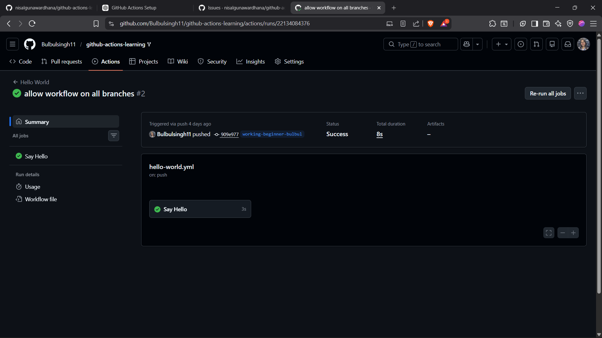
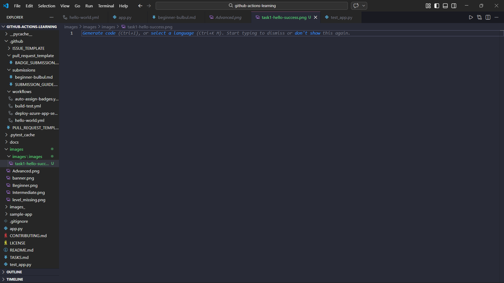
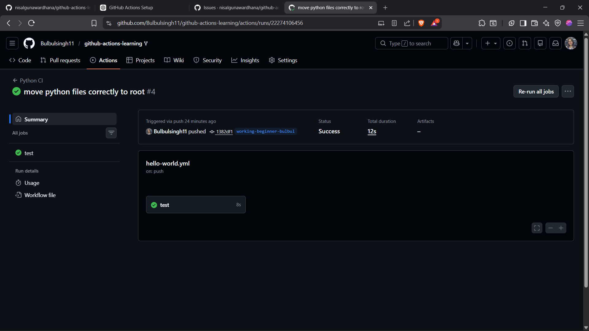

# Beginner Badge Submission - Bulbul

**Date:** February 2026  
**Status:** Submitted for Review

## Tasks Completed

-  Task 1: Run Your First Workflow
-  Task 2: Understand Workflow Triggers
-  Task 3: Build and Test Locally

## Evidence

### Task 1: Hello World Workflow

### Task 2: Move Python Files Correctly

### Task 3: Add Beginner Badge Submission

## Notes
Successfully configured GitHub Actions CI pipeline and verified workflow execution and local test validation.

---

Submitted & ready for review! ✅